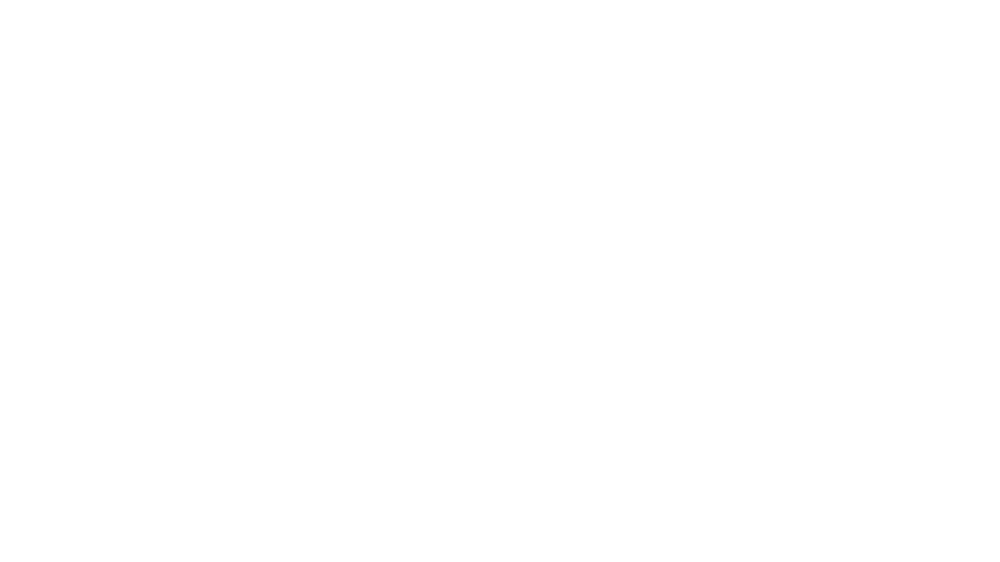
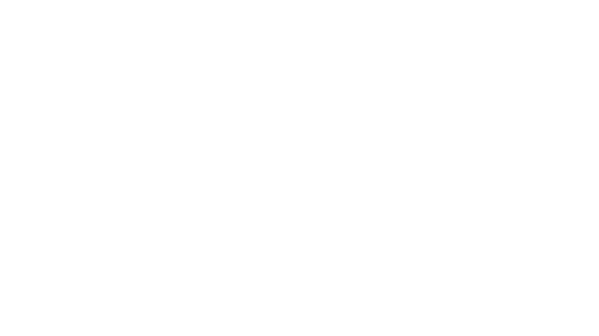
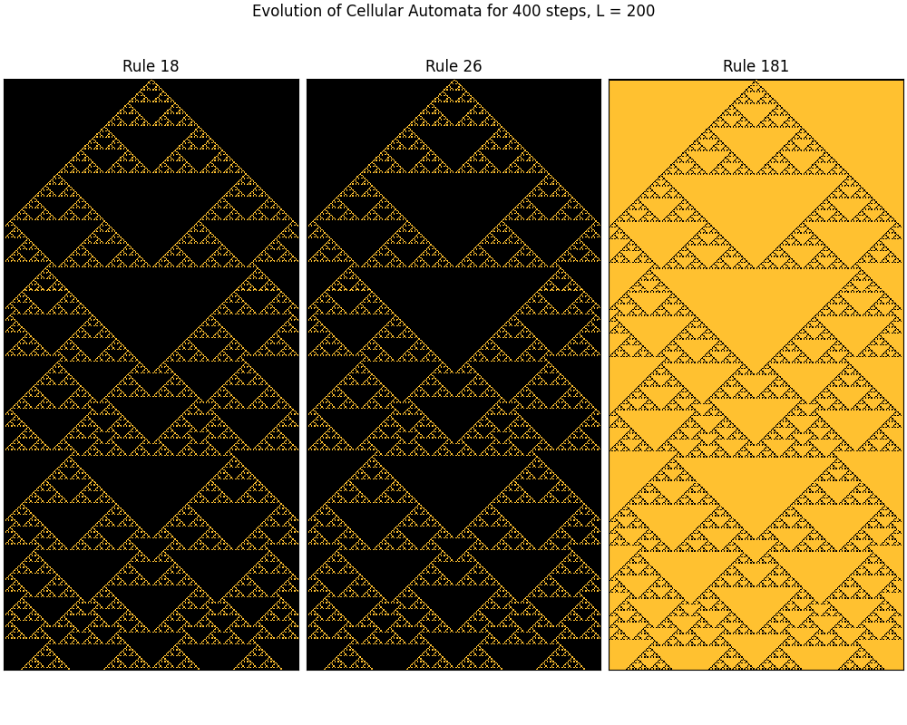
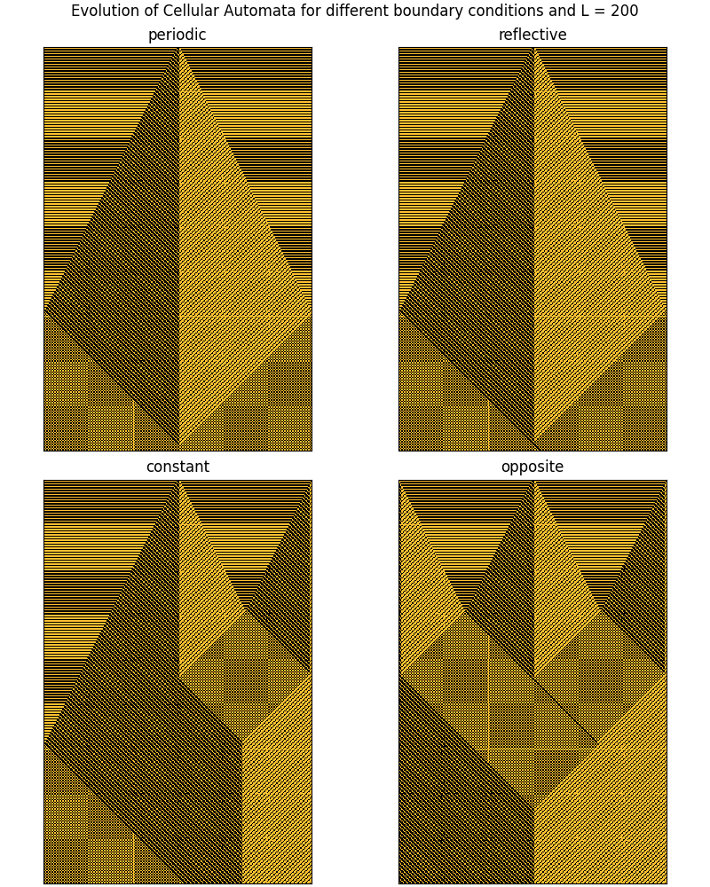
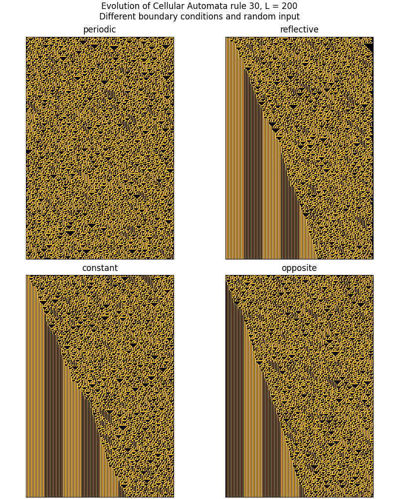
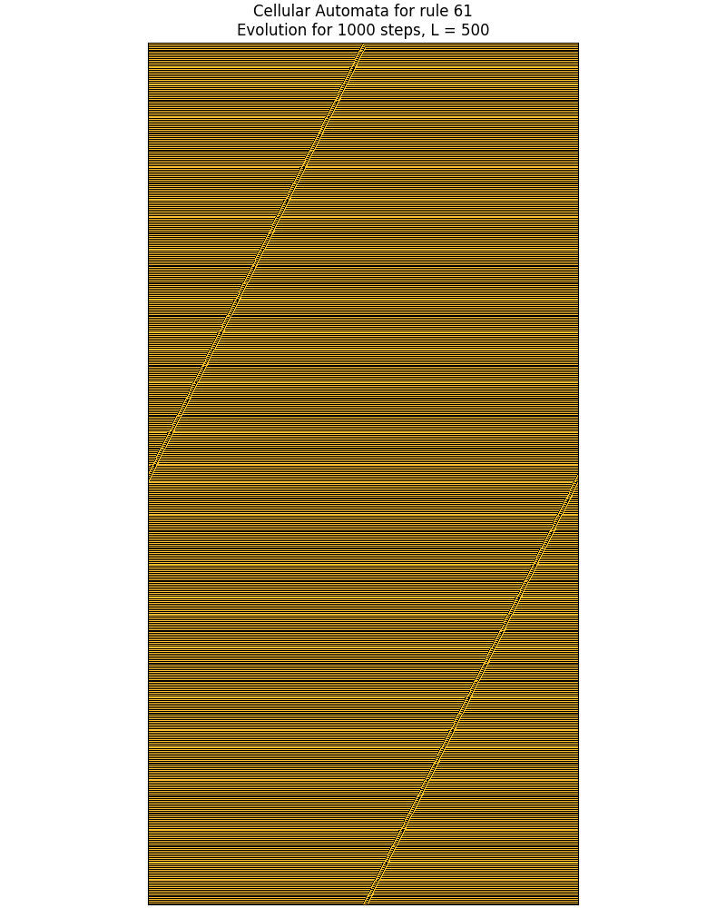

# Conway's Game of Life

Conway's Game of Life is an implementation of the cellular automation 
designed to demonstrate how simple rules can generate complex behavior.
Each cell is a site on a two-dimensional grid governed by Conway's rules, 
where cells can be born, survive or die. 
The project provides an interactive simulation where user can observe evolving cells.
The code is written in `Python 3.9` in `PyGame`, where calculations are performed in `NumPy` 
and optimized into machine code with `Numba`. 

### Running the simulation

To start we need to run the file `GameOfLife.py` and a black screen will pop up.
To create new cells you can click the left mouse button or press `G` to initialize random cells.
Press `Space` to start the simulation. There will be an initial freeze due to convertion into the cached machine code.
The simulation can be changed in real time:
* press `P` to toggle printing logs in the console
* press `G` to generate random cells
* press `C` to clear all cells
* press `E` to toggle edit mode
* when edit mode is active, the speed and size of the simulation can be changed.
To change the size, press `arrow up` or `arrow down`.
To change the speed, press `arrow left` or `arrow down`.
* the simulation allows to place custom objects (the edit mode needs to be deactivated).
You can place glider, ship or a pulsar by pressing `1`, `2` or `3`, respectively. 
To put it on the grid, simply click in a chosen area. To create single cells, 
you need to press the number corresponding to an active object again.
* The direction of a movable object can be changed by pressing of four arrows. 
To go back to random direction you need to press the active direction again.

The code containing cells and calculating their interactions is written in file `Cells.py`.

### Animations

# Cellular Automata

The second part of the project explores cellular automata in general.
They are mathematical models that evolve over time based on local rules encoded in a binary number.
The file `CellularAutomata.py` contains all code necessary for calculations and
its use case is presented in the Jupyter notebook `CellularAutomata.ipynb` file.

### Images

